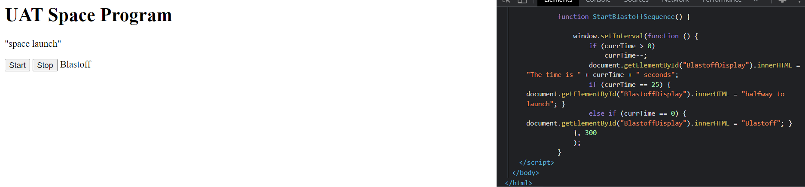

The UAT Space program demands the best practices in code for efficiency so you are tasked to make improvements to the code. 

This means you will need to add a loop instead of repeating the code. 
(Use Mission Control We have BlastOff, for reference for the assignment) then implement the loop.

Also, add a conditional (if statement) that if the countdown is less than 25 seconds, a message should read “Warning Less than ½ way to launch, time left = insert variable here” 

# REQUIREMENTS

 >👨🏿‍⚖️ Click name to downlaod

[Visual Code](https://code.visualstudio.com/download)

# INSTALLATION

>👨🏿‍⚖️ INSTALL ZIP FILE OR CLONE REPO

[click here](https://github.com/brprod8/EfficiencyMissionControl) to clone repo

# LICENSE
**Open to Experiment**

BY:ROBERT SMITH

CREDIT: University of Advancing Tech

EMAIL - Robertsdev8@gmail.com for Colloboration 
